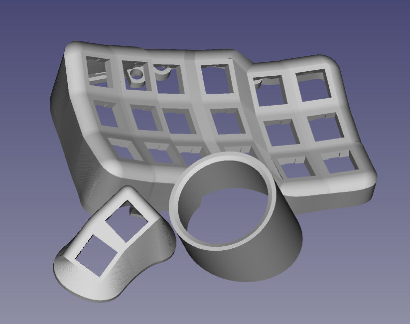
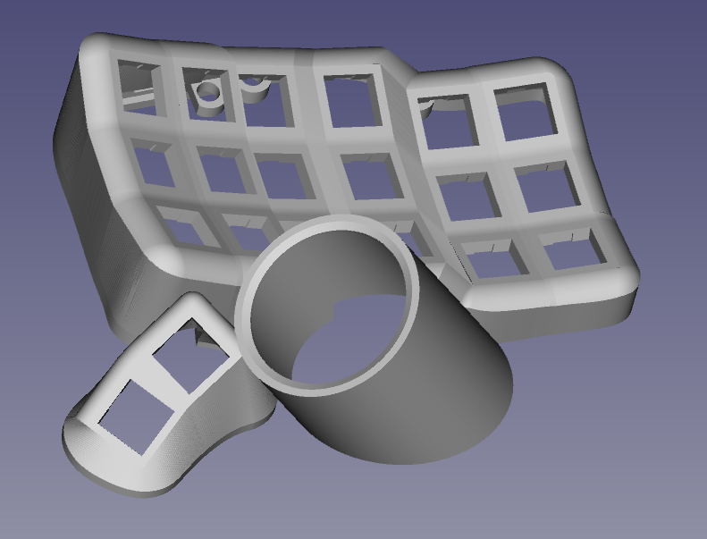
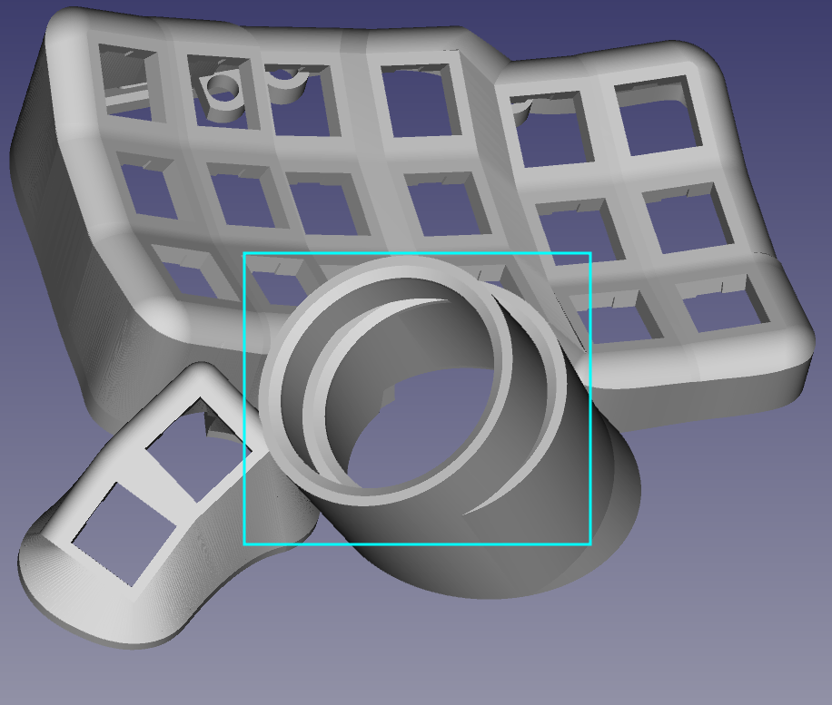

##  Ergosplit-3x6 trackball
Корпус для эргономичной клавиатуры с трекболлом. Корпус основан на модели без трекбола и единственное отличие - это уменьшение колличества кнопок под большой палец. 

Есть 2 версии клавиатуры, которые различаются только положением трекболла. Судя по опыту версия 2 более удобная для использования.
##### Версия 1

##### Версия 2

##### Сравнение 1 и 2 версии
Выделенна версия 2

#### Предупреждение
На данный момент клавиатура находить на стадии разработки и пока что готовы только корпусы. Данные корпуса полностью совместимы с клавиатурами [Bastardkb](https://github.com/Bastardkb), поэтому для сборки подходят их платы и прошивки, совместимые с данным проектом.
## Печать
Модель довольно сложная для печати, так как имееться огромное колличество нависающих элементов, от которых невозможно избавиться.

Перед печатью рекомендуеться проверить настройки поддержек.

